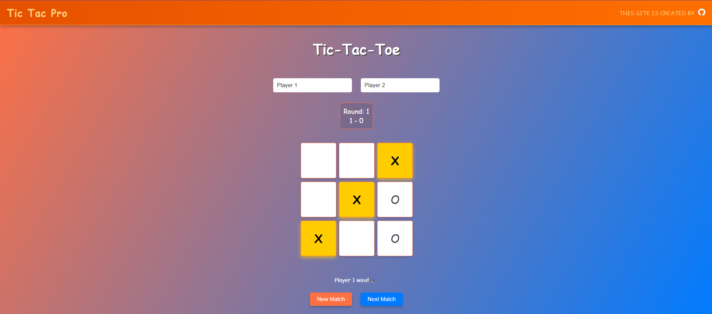

# INTERNCRAFTERS_WD_03

<p align="center">
<a href="#"></a>
</p>
<p align="center">
<a href="https://github.com/vxnuprasad"></a>
<a href="https://interncrafters.netlify.app/"></a>
</p>

# Tic Tac Pro ( Tic-Tac-Toe Web Application )

This project is an interactive **Tic-Tac-Toe Web Application** built using **HTML**, **CSS**, and **JavaScript**. The application allows two users to play against each other or one user to play against an AI opponent. It provides a clean and engaging interface, along with the core functionality to track the game state and check for winning conditions.

---

## Features

1. **Two Player Mode:**
   - Players take turns marking X or O on the grid.
   - Automatically checks for winning conditions or a draw after each move.

2. **AI Opponent:**
   - Play against a simple AI that makes calculated moves to challenge the player.

3. **Interactive Interface:**
   - Highlights winning combinations and provides clear instructions.

4. **Responsive Design:**
   - Fully functional on mobile and desktop devices.

---

## How It Works

1. **HTML:** Structures the tic-tac-toe grid and controls.
2. **CSS:** Styles the grid and game interface for a clean and professional look.
3. **JavaScript:**
   - Handles user clicks on the grid.
   - Tracks game state, such as player turns and moves.
   - Checks for winning conditions or a draw.
   - Implements AI functionality for single-player mode.

---

## Usage

### Clone the Repository:
```sh
git clone https://github.com/vxnuprasad/INTERNCRAFTERS_WD_03
```

### Open in Browser:
1. Navigate to the project folder.
2. Open the `index.html` file in any web browser to start playing the game.

---

## Contributions

If you find this project helpful, consider following [vxnuprasad](https://github.com/vxnuprasad) on GitHub! Feel free to fork the repository and contribute.

---

## Technologies Used

- **HTML:** To structure the game grid and user interface.
- **CSS:** To style the tic-tac-toe board and ensure responsiveness.
- **JavaScript:** To implement game logic, handle user interactions, and create the AI opponent.

---

## Find Me On:
[](https://www.linkedin.com/in/vxnuprasad)  
[](https://www.instagram.com/__.v.shnu/)  
